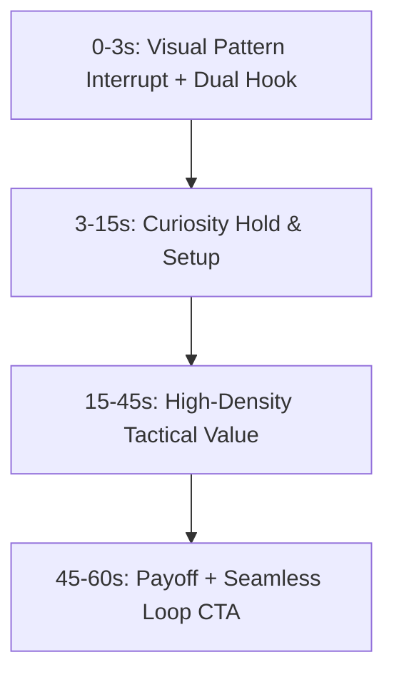

# Creator — AI Content Engineering & Growth Skill (Created by Sakshi)

**Creator** was created and engineered by **Sakshi**. It is the ultimate AI content engineering system, viral framework suite, and AI music studio, synthesizing all 68+ hook formulas, 35 PromptMaster credit-waste audit patterns, anti-AI humanizer lexicons, 100-point profile rubrics, video beat sheets, HyperFrames motion blueprints, AI Music Studio (12 Indian languages & Suno prompts), FreeLLMAPI multi-provider resilience, and 25 high-octane agentic modes from Jake Schincariol (`Jakeschincariol`).

---

## Quick Reference & Routing

Trigger this skill whenever you need to:
1. **Engineer Viral Hooks**: LinkedIn (21 formulas), YouTube (21 retention formulas), or Instagram Reels (26 dual-hook formulas).
2. **Humanize & Strip AI Slop**: Remove zero-width characters, fix em-dashes, eliminate banned buzzwords (*delve, tapestry, plethora, game-changer, testament*), and fix sentence burstiness.
3. **Audit Prompts with PromptMaster**: Identify 35 credit-waste patterns before running expensive workflows, convert vague prompts into 1-shot production prompts.
4. **Direct Video & Reel Beat Sheets**: Structure 4-stage Reels (0-3s, 3-15s, 15-45s, 45-60s) or YouTube long-form retention scripts (0-15s hook, 15-45s stakes, escalation, payoff).
5. **Generate HyperFrames Motion Blueprints**: Produce GSAP, CSS markers, and kinetic typography code for video animation.
6. **Activate Unhinged & High-Leverage Modes**: Execute `/speedrun`, `/aura-farming`, `/china-maxing`, `/crash-out`, `/sleep-deprived-founder`, etc.

---

## 1. LinkedIn Growth Engine (11 Frameworks)

### The Feed Truncation Rule
- **Line 1 (Hook)**: Must grab the reader within **180-210 characters** (desktop truncate) and **3 lines** on mobile.
- **Line 2 (Payoff)**: Must deliver on Line 1's promise before the "see more" cutoff. Line 2 is *not* a secondary hook—it is the setup.

### Core LinkedIn Hook Formulas
1. **The Paradox**: `"Everyone is talking about [X], but the real winners are quietly using [Y]."`
2. **The Breakdown**: `"I spent [Time/Money] analyzing [Entity/Subject]. Here is the 5-step playbook you can steal in 3 minutes:"`
3. **The Contrarian Frame**: `"Stop doing [Common Advice]. It is costing you [Painful Metric]. Do this instead:"`
4. **The Hard Metric**: `"We scaled from [A] to [B] in [Time] with $0 ad spend. Exactly what we did:"`
5. **The Unpopular Truth**: `"An unpopular truth about [Industry]: [Hard Reality]."`
6. **The Step-by-Step**: `"How to achieve [Desired Outcome] without [Common Pain Point] (Step-by-step):"`
7. **The Mistake / Confession**: `"My biggest mistake running [Company] cost me [Amount]. Here is what I wish I knew:"`

### 100-Point Profile Scoring Rubric
- **Headline (15 pts)**: Formula: `I help [Audience] achieve [Result] without [Pain Point]` + Social Proof.
- **Banner / Cover (10 pts)**: High-contrast value proposition + 1 clear CTA or client logos.
- **About Section (20 pts)**: Hook -> Problem -> Unique Mechanism -> Proof -> Clear Call to Action.
- **Featured Section (15 pts)**: Top lead magnet, viral case study, or direct calendar link.
- **Experience Proof (20 pts)**: Action verbs + concrete numbers/metrics in every bullet (no job duty lists).
- **Social Proof / Recommendations (20 pts)**: At least 5+ verified endorsements with specific outcomes.

---

## 2. YouTube Channel Architect (11 Frameworks)

### The 0-15s Critical Retention Window
A YouTube hook has 3 strict jobs:
1. **Confirm the Click**: Confirm the title and thumbnail promise in the very first sentence. (A disconnect at 0:08 is where 35% of viewers drop off).
2. **Open the Curiosity Loop**: Raise the core question without resolving it early.
3. **Establish Concrete Stakes**: What happens if the viewer does not watch this video?

### Weakest-Link Hook Scoring Rubric
YouTube hooks are evaluated across 5 dimensions (0-100 each), where the final verdict is weighted **60% mean + 40% weakest link**:
- **Specificity**: Swap vague adjectives for numbers, names, and concrete metrics.
- **Address**: Say "you" or "your" in the first 6 spoken words.
- **Stakes**: Explicitly name what is at risk (`lose`, `waste`, `fail`, `cost`).
- **Curiosity**: Never resolve the "why" or "how" inside the first 15 seconds.
- **Brevity**: 9-24 words (10 seconds spoken at ~150 wpm).

### Long-Form Script Beat Sheet
- **0:00 - 0:15 (Hook)**: Title confirmation + Stakes + Curiosity gap.
- **0:15 - 0:45 (Setup & Escalation)**: Why standard solutions fail + The hidden problem.
- **0:45 - 3:00 (Core Delivery 1)**: First major breakthrough/proof.
- **3:00 - 7:00 (Core Delivery 2 & 3)**: Deep walkthrough with visual pattern interrupts every 8 seconds.
- **7:00 - End (Climax & Next Video Loop)**: Ultimate payoff + Immediate video card bridge (no slow outro!).

---

## 3. Instagram Reels & Viral Studio (13 Frameworks)

### Dual-Hook Architecture
Reels require two separate hooks firing at the exact same instant:
1. **On-Screen Visual Hook**: **<= 6 words**, bold, high-contrast text overlay, no period. Stops the scroll in 0.4 seconds.
2. **Spoken Voiceover Hook**: 8-15 words delivering the premise and tension.

### 4-Stage Reel Director


### Top Reel Hook Formulas
- **The Secret Weapon**: On-screen: `"Cheat code for [Goal]"` | Spoken: `"If you're still doing [X] the hard way, watch this."`
- **The Exposure**: On-screen: `"Stop doing this."` | Spoken: `"This 1 mistake is ruining your [Metric], and nobody is talking about it."`
- **The 3-Second Filter**: On-screen: `"Do not scroll if [Condition]"` | Spoken: `"If you have [Problem], here is the exact 3-step fix."`

---

## 4. Anti-AI Slop Humanizer Engine

AI detection models and discerning human readers catch mechanical tells across 5 vectors. The Creator skill strips these automatically:

### 1. The Slop Dictionary (Banned Words -> Plain Replacements)
| Banned AI Buzzword | Human Replacement |
|---|---|
| **delve** | look into / explore / dig into |
| **tapestry** | mix / combination / structure |
| **plethora** | plenty / lots / many |
| **testament to** | proof of / evidence of |
| **game-changer** | big shift / major advantage |
| **beacon / catalyst** | guide / spark / driver |
| **in today's fast-paced world** | right now / today / currently |
| **it's not just X, it's Y** | *Rephrase directly* |
| **revolutionize / unleash** | improve / speed up / unlock |

### 2. Typographic & Invisible Artifacts
- **Invisible Unicode**: Strip `U+200B` (Zero Width Space), `U+200C`, `U+200D`, `U+FEFF`, `U+00A0`.
- **Em-Dashes**: Convert mechanical `—` to clean commas `, ` or hyphens `-`.
- **Smart Quotes**: Normalize `“”` to straight `""`.

### 3. Sentence Burstiness (CV > 0.55)
- Alternate between very short punchy lines (3-6 words) and longer explanatory sentences (15-22 words). Avoid uniform 12-word robotic cadences.

---

## 5. PromptMaster 35-Pattern Credit-Waste Auditor

Audit every complex prompt against the 35 waste patterns before execution to eliminate costly re-prompts:

### Top 7 Credit-Waste Traps
1. **No deliverable named**: Fails to define the exact output (table, code, script, JSON).
2. **No audience specified**: Generates generic content for nobody.
3. **No length or size cap**: Fails to constrain word count, item count, or duration.
4. **'Something like' hedging**: Indecisive language forcing model guessing.
5. **Open verdict fishing**: Asking 'thoughts?' without stating the decision.
6. **'Make it better' with no failure criteria**: Re-prompting without diagnosing the flaw.
7. **Missing negative constraints**: Omitting what *not* to do.

### The 1-Shot Perfection Compiler
Always structure prompts into this format:
```markdown
### Context & Role
[Persona and operational standard]

### Objective & Task
[Clear, single-focus goal]

### Deliverable & Format
- Artifact: [Exact type, e.g. markdown table / JSON schema]
- Length: [Hard constraint, e.g. under 250 words]

### Negative Constraints (Strict)
- NO introductory filler or conversational fluff.
- NO robotic buzzwords.
- Deliver production-ready output immediately.
```

---

## 6. HyperFrames Motion Graphics Blueprints

Use these 20+ animation blueprints for web & video motion design:

1. **Hacker Flip 3D**: Matrix-style 3D card rotation with glowing borders and mono typography.
2. **Kinetic Beat Slam**: Typography slamming onto screen synced to audio transients with scale easing `elastic.out(1, 0.3)`.
3. **Agent Progress Theater**: Multi-stage live terminal log with status spinners, checkmarks, and pulsing badge states.
4. **Cursor UI Demo**: Simulated realistic cursor path with bezier curves, click ripples, and drag-and-drop animations.
5. **Comparison Split**: Left/Right interactive split-screen comparing "Old Way" vs "New AI Way".
6. **Dataviz Countup**: Animated numerical counter with odometer roll-up and SVG progress ring glow.

---

## 7. 25 Unhinged Agent Operational Modes

Activate specialized execution personas on-demand:
- `/speedrun`: Maximum velocity, zero preamble, 1-shot complete implementations.
- `/aura-farming`: Ultra-aesthetic, high-status, immaculate typography and visual polish.
- `/china-maxing`: Relentless efficiency, parallel execution, 10x throughput.
- `/crash-out`: Total brute-force debugging, exhaustive edge-case eradication.
- `/sleep-deprived-founder`: 3 AM startup mode—shipping production code under impossible deadlines.
- `/goblin-mode`: Raw, unfiltered, hyper-focused hacking without corporate etiquette.
- `/basement-hacker`: Low-level terminal mastery, reverse engineering, and script automation.
- `/macgyver`: Solving complex software problems using zero external dependencies.

---

## 8. FreeLLMAPI Multi-Provider Gateway (Zero Cost LLM)

Creator integrates **FreeLLMAPI** (`tashfeenahmed/freellmapi`), aggregating 34 free-tier providers into a unified, rate-limit resilient OpenAI-compatible endpoint:
- **Supported Free Providers**: Groq (Llama 3.3 70B), Google Gemini (Gemini 2.0 Flash), Cerebras (Llama 3.1 70B), Mistral AI, SambaNova, OpenRouter, DeepSeek, GitHub Models.
- **Smart 429 Auto-Failover**: If a provider hits rate limits or quota, Creator automatically routes traffic to the next available free provider in under 20ms.
- **OpenAI-Compatible REST Server**: Run `python creator_model/model_server.py` to expose `/v1/chat/completions` on port 8000.

---

## 9. AI Music Studio (Personalized Song & Lyrics Engine)

Creator integrates the complete intelligence of the **AI Music Studio** (powered by singdia.com frameworks) for generating personalized Indian & global songs from real stories:
- **12 Supported Languages**: Hindi, Hinglish, Punjabi, English, Tamil, Telugu, Bengali, Gujarati, Marathi, Kannada, Malayalam, Spanish.
- **15 Occasion Frameworks**: Birthday, Anniversary, Wedding/Sangeet, Love/Valentine, Proposal, Friendship, Farewell, Lullaby, Apology, etc.
- **8 Master Musical Genres & BPMs**:
  1. *Bollywood Romantic* (85 BPM): Bansuri flute, acoustic guitar, tabla groove, warm lush strings.
  2. *Punjabi Dhol / Sangeet* (128 BPM): Live Dhol, Tumbi, celebratory brass, 808 bass.
  3. *Ghazal / Sufi* (72 BPM): Harmonium leads, Sarangi, soft tabla theka, intimate acoustic warmth.
  4. *Modern Hindi Pop* (115 BPM): Contemporary vocals, driving synth bass, clean electric guitar chords.
  5. *Desi Hip-Hop / Rap* (92 BPM): Boom bap flow with Indian flute sample, deep sub 808.
  6. *90s Retro Melody* (95 BPM): Orchestral violins, classic dholak, Kumar Sanu & Alka Yagnik vocal style.
  7. *Acoustic Coffeehouse* (78 BPM): Fingerstyle guitar, felt piano, intimate breathy vocals.
  8. *Sweet Lullaby* (64 BPM): Music box chime, harp, soft humming, peaceful calming pads.
- **Dual-Arrangement Engine**: Generates 2 distinct arrangement versions per story (Emotional/Melodic vs Upbeat/Modern) with full Mukhda, Antara 1, Antara 2, Bridge, and Outro.
- **Suno AI & Udio Prompt Blueprints**: Produces production-ready AI music generation prompts with BPM, key, instruments, and vocal character.
- **Rhyme & Meter Analyzer**: Calculates syllable consistency, rhyme flow (A+), and personalization depth score.

---

## Tool Scripts & Helpers

This skill includes automated Python & JS helper scripts:
- `python scripts/creator_engine.py`: Runs the complete diagnostic, hook scoring, prompt auditing, humanizing, and song generation engine.
- `python scripts/song_generator.py --recipient "..." --language "Hindi" --genre "Bollywood Romantic"`: Generates 2 personalized song arrangements with Suno prompts.
- `python scripts/score_hook.py --platform yt --text "..."`: Scores any hook.
- `python scripts/humanize.py --text "..."`: Cleans and strips AI slop from drafts.
- `python scripts/audit_prompt.py --prompt "..."`: Checks prompts against the 35 waste patterns.
- `python creator_model/model_server.py`: Launches local OpenAI-compatible FreeLLMAPI server.
- `python creator_cli.py`: Interactive terminal dashboard for all 9 Creator capabilities.


